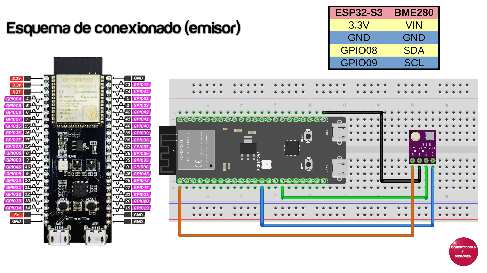
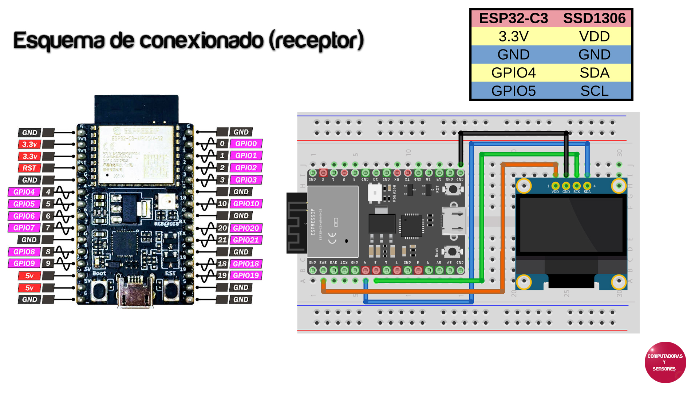

# ESP-NOW con 2 ESP32 Transmisión y Recepción datos de sensor BME280

Códigos en MicroPython tanto para el emisor como para el receptor

# Librerías necesarias
No olvidar descargar y agregar las librerías necesarias. Sensor bme280 para el emisor y SSD1306 para la pantalla OLED en receptor.

https://github.com/robert-hh/BME280/blob/master/bme280_float.py (luego renombrar a bme280.py)

https://github.com/stlehmann/micropython-ssd1306/blob/master/ssd1306.py

# Paso a paso

La explicación completa la podrás ver en el siguiente video de Youtube:
https://youtu.be/z5GlO2teX54
